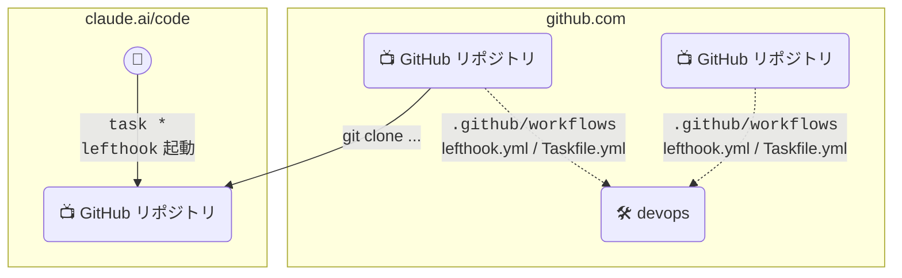

# 🛠️ DevOps ( 👉 FastShip CLI )
Organization 共通の CI / ruleset / Lefthook / Taskfile を管理するリポジトリ



## 📦 共通設定の配布
各リポジトリには次のように置く。Taskfile.yml と lefthook.yml は devops をタグで参照し、mise.toml と mise.lock はコピーする。

| ファイル | 配布方法 | 理由 |
|:--|:--|:--|
| `Taskfile.yml` | devops を `includes:` で参照 | Task の remote include で取り込める |
| `lefthook.yml` | devops を `remotes:` で参照 | lefthook の remotes で取り込める |
| `mise.toml` / `mise.lock` | devops からコピー | mise には別リポジトリの設定を読み込む仕組みがない（`include` は unknown field として無視される） |

```yaml
# Taskfile.yml
version: '3'

includes:
  common:
    taskfile: https://github.com/theindiehacker/devops.git//Taskfile.yml?ref=v1.3.0
    # 共通 lefthook.yml が `task security:check` を名前空間なしで呼ぶため、タスクをトップレベルに展開する
    flatten: true
```

```yaml
# lefthook.yml
remotes:
  - git_url: https://github.com/theindiehacker/devops
    ref: v1.3.0
    configs:
      - lefthook.yml
```

> ⚠️ devops は PRIVATE のため、参照元の環境（開発者のマシン・CI・claude.ai/code）から devops を git clone できる必要がある。
> Task は remote の Taskfile を初めて読むときに確認を求めるため、非対話の環境では `task --yes ...` で実行する。

## ❓ 使い方
### 🎊 セットアップ

[docs/SETUP.md](./docs/SETUP.md) を参照して、実行してください。
