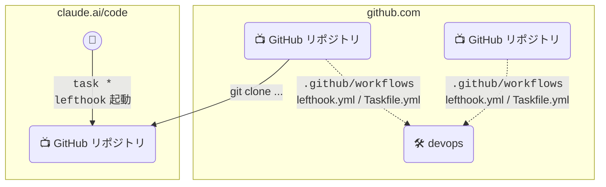

# 🛠️ Dev Ops
Organization 共通の CI / ruleset / Lefthook / Taskfile を管理するリポジトリ



```yaml
# lefthook.yml
remotes:
  - git_url: https://github.com/theindiehacker/devops
    ref: v1.0.0
    configs:
      - lefthook.yml
```

```yaml
# Taskfile.yml
includes:
  common: https://github.com/theindiehacker/devops.git//Taskfile.yml?ref=v1.0.0
```

```yaml
# 各リポジトリの mise.toml
include = ["git::https://github.com/theindiehacker/devops.git//mise.toml?ref=v1.0.0"]
```

## ❓ 使い方
### 🎊 セットアップ

[docs/SETUP.md](./docs/SETUP.md) を参照して、実行してください。
