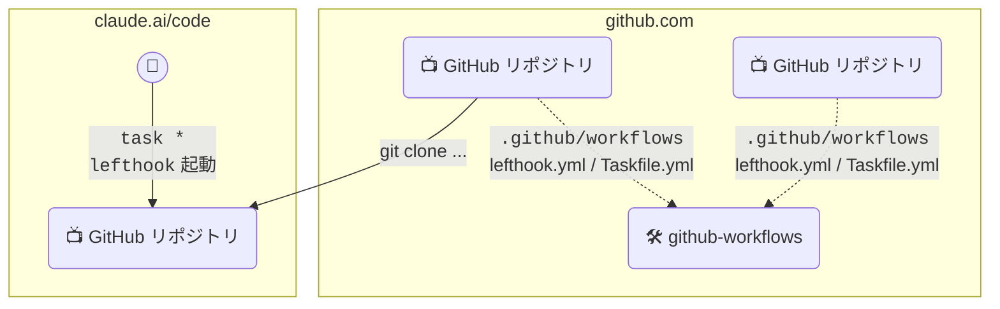
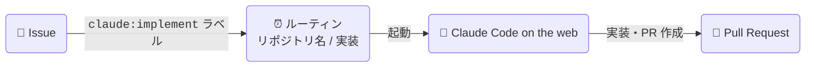

# 🛠️ github-workflows ( 👉 FastShip CLI )
Organization 共通の CI / ruleset / Lefthook / Taskfile / Claude Code プラグインを管理するリポジトリ


```mermaid
graph TD;
    subgraph GitHub ["github.com"]
        workflows("🛠️ github-workflows")
        other1("📺 GitHub リポジトリ")
        other2("📺 GitHub リポジトリ")
        
        other1 & other2 -.->|<code>.github/workflows</code><br/>lefthook.yml / Taskfile.yml| workflows
    end
    
    subgraph claude ["claude.ai/code"]
        other1 -->|git clone ...| clone1("📺 GitHub リポジトリ")
        
        agent(("🧠")) -->|<code>task *</code><br/><code>lefthook</code> 起動| clone1
    end
```

## 📦 共通設定の配布
各リポジトリには次のように置く。Taskfile.yml と lefthook.yml は github-workflows をタグで参照し、mise.toml と mise.lock はコピーする。

| ファイル | 配布方法 | 理由 |
|:--|:--|:--|
| `Taskfile.yml` | github-workflows を `includes:` で参照 | Task の remote include で取り込める |
| `lefthook.yml` | github-workflows を `remotes:` で参照 | lefthook の remotes で取り込める |
| `mise.toml` / `mise.lock` | github-workflows からコピー | mise には別リポジトリの設定を読み込む仕組みがない（`include` は unknown field として無視される） |

```yaml
# Taskfile.yml
version: '3'

includes:
  common:
    taskfile: https://github.com/theindiehacker/github-workflows.git//Taskfile.yml?ref=v1.4.1
    # 共通 lefthook.yml が `task security:check` を名前空間なしで呼ぶため、タスクをトップレベルに展開する
    flatten: true
```

```yaml
# lefthook.yml
remotes:
  - git_url: https://github.com/theindiehacker/github-workflows
    ref: v1.4.1
    configs:
      - lefthook.yml
```

> ⚠️ github-workflows は PRIVATE のため、参照元の環境（開発者のマシン・CI・claude.ai/code）から github-workflows を git clone できる必要がある。
> Task は remote の Taskfile を初めて読むときに確認を求めるため、非対話の環境では `task --yes ...` で実行する。

Claude Code on the web で pre-commit を動かすには、`.claude/settings.json` に次の SessionStart hook も置く（詳細は [docs/CLAUDE-WEB-SETUP.md](./docs/CLAUDE-WEB-SETUP.md)）。

```json
{
  "hooks": {
    "SessionStart": [
      {
        "hooks": [
          {
            "type": "command",
            "command": "curl -fsSL https://raw.githubusercontent.com/theindiehacker/github-workflows/v1.4.1/scripts/claude-web-setup.sh | bash"
          }
        ]
      }
    ]
  }
}
```

## 🧩 Claude Code プラグイン
マーケットプレイス（`fastship`）は [theindiehacker/fastship-plugin](https://github.com/theindiehacker/fastship-plugin) に移した。導入・更新の手順は同リポジトリを参照。

## ❓ 使い方
### 🎊 セットアップ

[docs/SETUP.md](./docs/SETUP.md) を参照して、実行してください。

### 🤖 Claude Code on Web

#### 🏷️ Issue にラベルを付けたら設計・開発を始める


```mermaid
graph LR;
    issue("📝 Issue") -->|<code>claude:implement</code> ラベル| routine("⏰ ルーティン<br/>リポジトリ名 / 実装")
    routine -->|起動| session("🧠 Claude Code on the web")
    session -->|実装・PR 作成| pr("🔀 Pull Request")
```

`/dev:setup` を実行すると、対象リポジトリに `claude:implement` ラベルを作り、実行者の claude.ai アカウントに「`<リポジトリ名> / 実装`」ルーティンを用意する（手順の詳細は [plugins/dev/skills/setup/SKILL.md](./plugins/dev/skills/setup/SKILL.md) の「6.」）。

> ⚠️ ルーティンは実行者個人の claude.ai アカウントに紐づき、チームでは共有されない。Claude GitHub App が対象リポジトリにインストールされている必要がある。
>
> トリガーは「Issue のラベルに `claude:implement` を含む」で判定するため、`claude:implement` が付いた Issue に別のラベルを足したときも起動しうる。

<details><summary>✋ <b>手動でルーティンを作る場合</b></summary>

https://claude.ai/code/routines にアクセスして、以下のように設定する


<br/>

<br/>

<br/>

<br/>
*任意のラベル名(画面では `claude:implement`)を指定する*

</details>