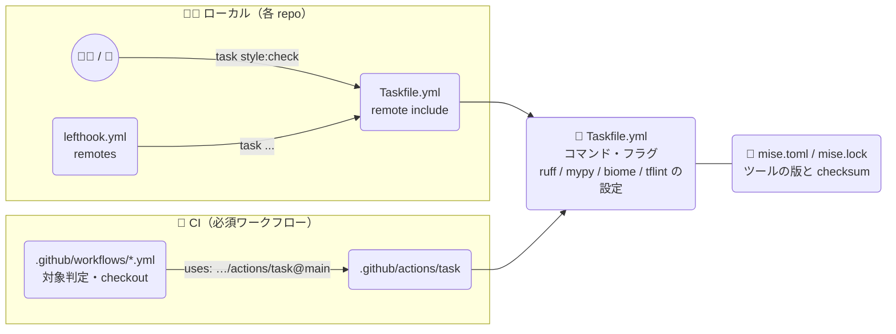
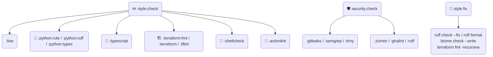
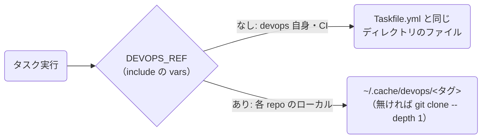
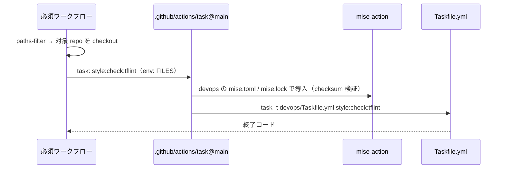
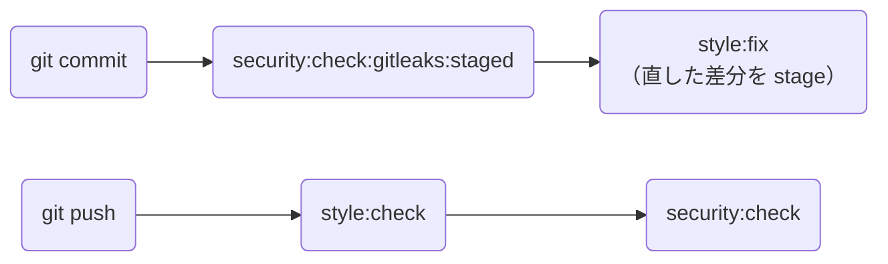

# ✅ チェックの一元化

セキュリティチェック・リント・フォーマッターの **コマンド・フラグ・設定** は `Taskfile.yml` だけに書く。ローカル（`task` / lefthook）でも CI（必須ワークフロー）でも同じタスクを実行する。

## 🧩 タスク

| タスク | 必須ワークフロー | 中身 |
|:--|:--|:--|
| `style:check:python:rule` | `python.yml` | uv で依存を管理しているか（requirements.txt 等の禁止、uv.lock への所属） |
| `style:check:python:ruff` | `python.yml` | `ruff check` / `ruff format --check` |
| `style:check:python:types` | `python.yml` | uv.lock ごとに `uv lock --check` → `uv sync` → mypy → lint-imports → deptry |
| `security:check:ruff` | `python.yml` | ruff の `S` ルール（`S101` を除く） |
| `style:check:typescript` | `typescript.yml` | 導入単位ごとに biome ci → `bun install` → knip → tsc |
| `style:check:terraform:fmt` | `terraform-fmt.yml` | `terraform fmt -check` |
| `style:check:terraform` | `terraform.yml` | `terraform init` → validate → test |
| `style:check:tflint` | `tflint.yml` | `tflint-ignore` の禁止 → tflint |
| `style:check:shellcheck` | `shellcheck.yml` | `shellcheck --severity=warning` |
| `style:check:actionlint` | `actionlint.yml` | actionlint |
| `security:check:gitleaks` | `gitleaks.yml` | gitleaks（インライン allow は無効） |
| `security:check:semgrep` | `semgrep.yml` | Semgrep CE（p/default・ERROR、nosemgrep は無効）。依存はハッシュ固定の `tools/semgrep/requirements.txt` から入れる |
| `security:check:trivy` | `trivy.yml` | インライン ignore の禁止 → trivy fs（`IMAGE` を渡すと trivy image） |
| `security:check:zizmor` | `zizmor.yml` | インライン ignore の禁止 → zizmor（HIGH 以上） |
| `security:check:ghalint` | `ghalint.yml` | ghalint |
| `style:check:line` | – | 1 ファイル 500 行まで（`*.ts` / `*.py`） |
| `security:check:gitleaks:staged` | – | pre-commit 用（staged の変更だけ） |

### ローカルと CI の違い

ローカルはリポジトリ全体を検査する。CI は環境変数で範囲を絞る（PR が触っていない箇所に元からある違反で fail させないため）。

| 環境変数 | ローカル（未設定） | CI |
|:--|:--|:--|
| `FILES` | git 管理下の全ファイル | paths-filter が出力した変更ファイル（terraform fmt / tflint / shellcheck / zizmor） |
| `LOG_OPTS` | 全履歴 | `base..head`（gitleaks） |
| `BASELINE` | なし | PR の base SHA（semgrep） |
| `IMAGE` | なし | ビルドしたイメージ（trivy） |

CI では `GITHUB_ACTIONS` を見て、zizmor の出力を annotation 形式にする（repo ルートからの相対パスで出せて、オプション 1 つで付けられるものだけ）。

## ⚙️ 共通設定

ruff / mypy / biome / tflint の設定は devops 直下のファイルで管理し、`--config` などで明示的に渡す。各 repo の設定ファイル（`[tool.ruff]` / `[tool.mypy]` / `biome.json` / `.tflint.hcl`）は読まない。

| ファイル | ツール | 主な設定 |
|:--|:--|:--|
| [`pyproject.toml`](../pyproject.toml) | ruff | `select = ["ALL"]`、py314、120 桁、テストディレクトリの per-file-ignores |
| [`pyproject.toml`](../pyproject.toml) | mypy | `disallow_untyped_defs` など。検査対象は uv プロジェクトごとの git 管理下の `*.py` / `*.pyi`。`src/` があれば `MYPYPATH`、pydantic があれば `pydantic.mypy` を実行時に足す |
| [`biome.json`](../biome.json) | biome | `recommended`、スペース 2・120 桁、organizeImports。対象は git 管理下のファイル |
| [`.tflint.hcl`](../.tflint.hcl) | tflint | terraform ruleset の `all` プリセット + google / aws ruleset |

remote include では `Taskfile.yml` しか取得されないため、設定ファイルは次のように用意する。

リリースタグは不変（docs/SETUP.md「🏷️ リリースタグ」）なので、一度 clone したものを使い回す。`DEVOPS_REF` は include の `ref` と同じタグにする。

repo 固有の例外は `# noqa` / `# type: ignore[...]` / `// biome-ignore` で個別に外す。

## 🔐 CI で devops を読む仕組み

devops は private なので、対象 repo の `github.token` では checkout できない。代わりに composite action を参照すると、runner が devops 全体をダウンロードする。

- action は `@main` で参照する。自分自身の SHA はそのコミットに書けないため、`Taskfile.yml` の変更をすぐ CI に反映するにはブランチで参照するしかない。ghalint / zizmor はこの action だけを SHA 固定のルールから外している（`.github/ghalint.yml` / `.github/zizmor.yml`）
- `Taskfile.yml` / `pyproject.toml` / `biome.json` / `.tflint.hcl` / `tools/**` / `mise.toml` / `mise.lock` / `.github/actions/**` の変更には security チームの承認が要る（docs/SETUP.md「🛠️ 検知ワークフロー変更の承認必須化」）

## 🪝 lefthook

重い検査（依存の導入・mypy・trivy など）は push 時に行う。
