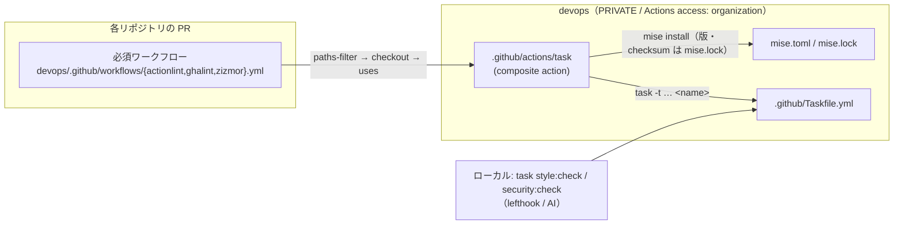

# Taskfile と GitHub Actions の統一（設計案 / レビュー用）

> ステータス: **実装済み**（2026-10-08。§6 は推奨どおりで合意、action の参照は `@main` に決定）。
> 対象: `actionlint` / `ghalint` / `zizmor` の 3 本（他の必須ワークフローは、この仕組みが固まってから同じ型で移す）

## 1. 目的

同じチェックが「CI（`.github/workflows/*.yml`）」と「ローカル（`.github/Taskfile.yml`）」に二重に書かれていて、フラグ・バージョン・対象範囲がずれていく。
**Taskfile を唯一の正とし、必須ワークフローは `task <name>` を呼ぶだけにする。** ローカル（AI / lefthook）で通れば CI でも通る、を保証する。

## 2. 現状のずれ

| 項目 | CI（ワークフロー） | ローカル（Taskfile） |
|:--|:--|:--|
| ツールのバージョン | 各ワークフローの `VERSION` / `SHA256`（Renovate の regex manager で更新） | `mise.toml` / `mise.lock` |
| actionlint | `-format`（PR annotation） | `-oneline -no-color` |
| ghalint | ログを解析して annotation 生成 | `--log-color never run` |
| zizmor の対象 | **PR の差分ファイルのみ**（設定変更時は全体） | リポジトリ全体 |
| zizmor の online 監査 | `GH_TOKEN` で有効。devops だけを参照するファイルは online を外す振り分けあり | `--offline` 固定 |
| zizmor の ignore 禁止 | tracked ファイルのみ | untracked も対象 |
| 実行対象のスキップ | paths-filter で対象ファイルの変更が無ければ skip | なし |

## 3. 設計

### 3.1 全体像



### 3.2 Taskfile（`.github/Taskfile.yml`）

- ツールごとにタスクを分け、CI からは 1 ツールずつ、ローカルからはまとめて呼ぶ。

  | タスク | 中身 | 呼び出し元 |
  |:--|:--|:--|
  | `actionlint` | `actionlint -oneline -no-color` | CI: actionlint.yml / ローカル: `style:check` |
  | `ghalint` | `ghalint --log-color never run` | CI: ghalint.yml / ローカル: `security:check` |
  | `zizmor` | ignore 禁止チェック → `scripts/zizmor.sh` | CI: zizmor.yml / ローカル: `security:check` |
  | `style:check` / `security:check` | 上をまとめて呼ぶ（現状のまま） | 直下の Taskfile・lefthook |

- **実行ディレクトリは「検査対象リポジトリのルート」**にする（`{{.TASKFILE_DIR}}/..` では CI で devops の action 配下を指してしまう）。
  ```yaml
  vars:
    REPO_ROOT:
      sh: git -C "{{.USER_WORKING_DIR}}" rev-parse --show-toplevel
  ```
  各タスクはコマンドの先頭で `cd "{{.REPO_ROOT}}"` する（`dir:` に絶対パスを書くと、別の Taskfile から include されたときに include 元のパスと連結されて壊れるため）。
- 対象が無いリポジトリでは成功扱いで skip する（ワークフローが無いと actionlint は exit 3、pre-commit 設定しか無いと zizmor 1.30 は「no inputs collected」で exit 3 になるため）。
- **zizmor は CI の挙動に寄せる**:
  - `GH_TOKEN` があれば online 監査あり、無ければ `--offline`（ローカルはトークン不要のまま）
  - devops だけを参照するファイルを online から外す振り分け（yq を使う現行ロジック）は、Taskfile に直書きせず `.github/scripts/zizmor.sh` に移して Taskfile から呼ぶ（`bash script.sh` で実行。heredoc で stdin に流すと fail-open になる既知の落とし穴を避ける）
  - 対象は**常にリポジトリ全体**（差分スキャンはやめる）

### 3.3 composite action（`.github/actions/task/action.yml`、新規）

- inputs: `task`（タスク名）/ `tools`（mise で入れるツール。例 `task actionlint shellcheck`）
- jdx/mise-action（SHA 固定、mise 本体の版も固定）で mise だけ入れる。`working_directory` を devops のルートにし、`install` / `env` / `add_shims_to_path` は false（呼び出し元の mise.toml を一切使わない）
- 1 つの step で、devops のルートの mise.toml / mise.lock から `MISE_LOCKED=1` で `mise install` → devops の版の `mise bin-paths` をその step の PATH にだけ足して、呼び出し元の checkout（`GITHUB_WORKSPACE`）で `task --taskfile <devops>/.github/Taskfile.yml <task>` を実行
  - `GITHUB_PATH` に書くと後続 step の PATH を書き換えられる（zizmor の github-env）ため使わない
  - mise.toml の postinstall（`lefthook install`）は CI では失敗するが WARN のみで install は成功する

- devops は PRIVATE だが、`Actions access` が `organization`（確認済み）なので、組織内リポジトリから `uses: theindiehacker/devops/.github/actions/task@main` で参照でき、**action と一緒に devops の Taskfile / mise.lock / scripts も取得される**（追加の clone やトークン不要）。
- 入力値は `run:` に直接埋め込まず `env:` 経由で渡す（zizmor の template-injection 対策）。
- jdx/mise-action v5.1.1 は `persist_github_token` が既定で false のため、トークンを job の env に書き出さない。

### 3.4 ワークフロー（3 本のまま残す）

- **ファイル・ジョブ名は変えない** → ruleset（docs/SETUP.md の必須ワークフロー表）とチェック名はそのまま。
- 残すもの: `on` / `permissions` / `concurrency` / paths-filter による skip 判定 / checkout
  - skip 判定はワークフローに残す（必須ワークフローは全 PR で起動され、対象外の PR でも success で終わる必要があるため。Taskfile の関心事ではない）
- 消すもの: ツールのインストール step（VERSION / SHA256）、annotation 生成、zizmor の対象列挙・振り分け → すべて Taskfile 側へ
- 例（actionlint.yml の後半）:
  ```yaml
      - uses: theindiehacker/devops/.github/actions/task@main
        if: steps.filter.outputs.workflows == 'true'
        with:
          task: actionlint
          tools: task actionlint shellcheck   # actionlint は shellcheck を自動で使う
  ```

### 3.5 バージョン管理

- 版と checksum は **`mise.toml` / `mise.lock` だけ**に置く。ワークフローの `# renovate:` + `VERSION` / `SHA256` は 3 本から削除。
- `mise.lock` には linux-x64 / linux-arm64 / macos の checksum を `mise lock` で入れてある（actionlint / ghalint / zizmor の linux-x64 checksum は旧ワークフローの `SHA256` と一致することを確認済み）。
- Renovate: `mise.toml` は組み込みの mise manager で更新される。`mise.lock` の追随は**要確認**（追随しない場合は postUpgradeTasks などが必要）。

### 3.6 やめるもの（意図的な仕様変更）

| やめるもの | 理由 / 影響 |
|:--|:--|
| PR annotation | AI が実装・修正する前提で不要（2026-10-08 合意済み）。ログは 1 行形式で読める |
| zizmor の差分スキャン | ローカルと結果を一致させるため。**未変更ファイルの既存違反でも PR が落ちるようになる** → 切り替え前に全リポジトリで通ることを確認する |

### 3.7 `@main` で参照する理由と除外設定

必須ワークフロー自体が devops の `main` を参照しているため、composite action も `@main` で参照し、Taskfile とワークフローを常に同じ版で動かす（SHA + タグで固定すると、Taskfile を変えるたびに「リリース → SHA 更新」の 2 段階が必要になり、その間ずれる）。信頼境界は変わらない。
ghalint / zizmor は SHA 未固定を違反にするため、devops の承認必須の設定ファイルでこの action だけを除外する。

- `.github/ghalint.yml`: `action_ref_should_be_full_length_commit_sha` を `action_name: theindiehacker/devops/.github/actions/task` で除外
- `.github/zizmor.yml`（新規）: `unpinned-uses` の policies で `theindiehacker/devops/.github/actions/task` だけ `ref-pin`、それ以外は `"*": hash-pin`

## 4. 移行手順

1. ✅ Taskfile のタスク分割・`REPO_ROOT`・`scripts/zizmor.sh`・`mise lock`・composite action・3 本のワークフロー・除外設定を 1 つの PR で実装
2. ✅ 他リポジトリの棚卸し（下表。ローカルの作業ツリーで実行）
3. 落ちるリポジトリを先に直す（または、そのリポジトリの次の Actions 関連 PR で直す前提で進める）
4. マージ（必須ワークフローは `main` 参照のため、マージ時点で全リポジトリに反映される）→ ドラフト PR で 3 本の success / skip を確認

棚卸し結果（2026-10-08）:

| リポジトリ | actionlint | ghalint | zizmor | 備考 |
|:--|:--|:--|:--|:--|
| how-much.fun | ✅ | ❌ | ❌ 17 high | SHA 未固定・persist-credentials 等 |
| openpa.ge | ❌ | ❌ | ❌ 23 high | shellcheck 指摘・SHA 未固定 等 |
| saas.fastship.jp | ❌ | ❌ | ❌ 101 high | `needs` 空・SHA 未固定・template-injection 等 |
| 上記以外（chat2web.com / fastship-foundation / fastship-py / openpage.now / registry.fastship.jp / renovate-config / terraform-modules / app.fastship.jp / chatquery / fastship-plugins） | ✅ | ✅ | ✅ | 対象なしの skip を含む |

actionlint / ghalint は従来から全体が対象のため、❌ は今回の変更で新たに落ちるものではない（対象ファイルを変更した PR で既に落ちる）。zizmor は差分スキャンから全体スキャンになったため、上の 3 リポジトリでは Actions 関連ファイルを変更した PR で未変更ファイルの違反でも落ちるようになる。

## 5. 検証

- devops: `task style:check` / `task security:check` が通る、壊したワークフローで各タスクが非 0 で落ちる
- CI: devops の PR で 3 本が success、対象ファイル変更なしの PR で skip（success）
- 他リポジトリ: ドラフト PR を 1 つ立て、devops の action を参照して 3 本が動くこと（private の action 取得・online 監査・devops 参照ファイルの振り分け）

## 6. 決定事項（2026-10-08）

1. zizmor は差分スキャンをやめて全体スキャンにする（ローカルとの一致を優先）
2. ワークフローは 3 本のまま残す（ruleset とチェック名を変えない。1 本化は他の必須ワークフローを移すときに改めて検討）
3. 他リポジトリでのローカル実行（各リポジトリの Taskfile から devops の Taskfile を include する方法）は今回の範囲外
4. composite action は `@main` で参照する（§3.7）
